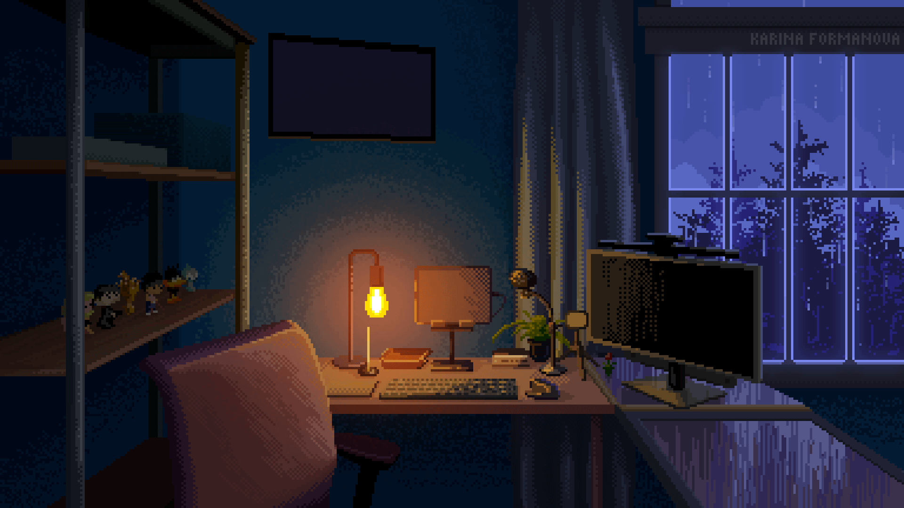

  

#

Sou Daniel Duarte, estudante de Engenharia de Software e desenvolvedor em aprendizado. Apaixonado por tecnologia e sempre buscando evoluir através de projetos e estudos práticos. Aqui compartilho repositórios, projetos e estudos com programação.

#

<h3 align="left">Connect with me!</h3>

<h3 align="left">Stacks ~</h3>

 
 

<h3 align="left">Stats</h3>

  
  

          

<picture align="center">
  <source media="(prefers-color-scheme: dark)" srcset="https://raw.githubusercontent.com/dnlduarte/dnlduarte/output/github-contribution-grid-snake-dark.svg">
  <source media="(prefers-color-scheme: light)" srcset="https://raw.githubusercontent.com/dnlduarte/dnlduarte/output/github-contribution-grid-snake-dark.svg">
  
</picture>
